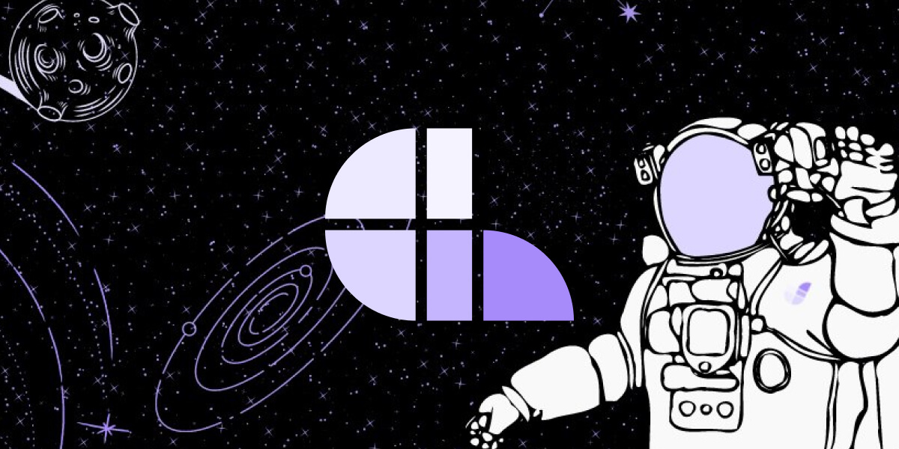
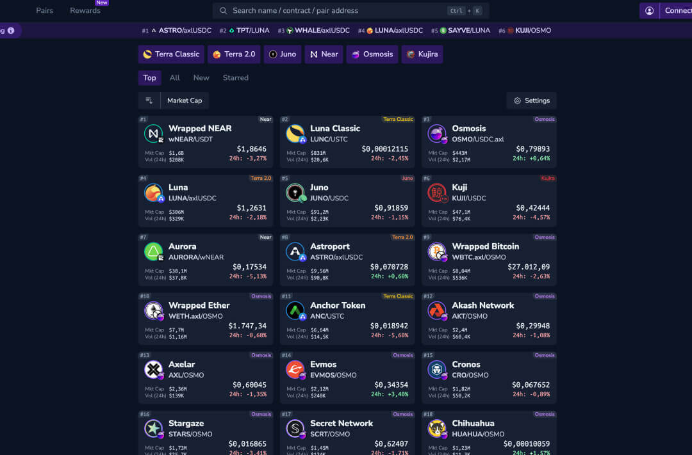
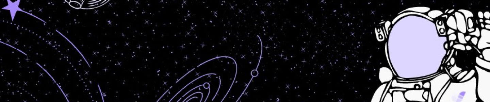

# Juno Website

## App Assets Guide
To ensure your app's assets are displayed correctly on the Juno website, adhere to the following specifications. Refer to the detailed [App Assets Guide](https://www.figma.com/community/file/1285579551089973016/Juno-App-Assets-Guide) for visual examples.

### App Icon (Logo)


- Size: 216x216px
- Format: Preferably squared SVG, JPEG acceptable
- Background: Must be solid
- Path: `public/ecosystem/icons/`
  - ✅ Solid background
  - ❌ No transparencies
  - ❌ No PNG
  - ❌ No rounded corners (CSS applied)

### Cover Image


- Size: 1200x600px
- Format: JPEG
- Path: `public/ecosystem/cover-images/`
  - ✅ Minimal text like a slogan
  - ✅ Your logo
  - ❌ No PNG
  - ❌ No excessive text
  - ❌ No full UI screenshots (single widget okay)
  - ❌ No rounded corners (CSS applied)

### App Preview


- Size: 720x474px
- Format: JPEG
- Path: `public/ecosystem/app-previews/YOUR_PROJECT/`
  - ✅ Provide **3-10 images**
  - ✅ Focus on individual elements
  - ✅ Additional graphics, frames, or text (small display)
  - ❌ No PNG
  - ❌ No rounded corners (CSS applied)

### Background


- Size: 2880x600px
- Format: JPEG
- Path: `public/ecosystem/background-images/`
  - ✅ Artwork only
  - ❌ No PNG
  - ❌ No text or logos
  - ❌ No screenshots

Place your assets in the respective directories and include their paths in your `ecosystem.json` pull request.

## How To Submit Your Project To The Ecosystem Page
Submit a pull request to add your project to the Juno ecosystem page. Edit `ecosystem.json` in `assets/json/` and add your project's info as shown in the example below:

```json
{
  "id": "generate-a-uuid",
  "icon": "icon-file-name.jpg",
  "backgroundImage": "background-image-file-name.jpg",
  "coverImage": "cover-image-file-name.jpg",
  "appPreviews": [
    "app-previews/YOUR_PROJECT/app-preview-1.jpg",
    "app-previews/YOUR_PROJECT/app-preview-2.jpg",
    "app-previews/YOUR_PROJECT/app-preview-3.jpg"
  ],
  "appLinks": {
    "chrome": "link-to-chrome-app",
    "firefox": "link-to-firefox-app",
    "android": "link-to-android-app",
    "ios": "link-to-ios-app"
  },
  "title": "Your Project Title",
  "text": "Your project description.",
  "category": "Your Project Category",
  "website": "your-project-website",
  "github": "your-github-link",
  "discord": "your-discord-link",
  "twitter": "your-twitter-link",
  "telegram": "your-telegram-link"
}
```

**id**: This is the ID. Generate a new one here https://www.uuidtools.com/v4

**icon**: This is the name of the image file which should be present in `public/ecosystem/icons/`

**backgroundImage**: This is the name of the background image file which should be present in `public/ecosystem/background-images/`

**coverImage**: This is the name of the cover image file which should be present in `public/ecosystem/cover-images`

**appPreviews**: This is an array with the name of the preview image files (at least 3) prefixed by `app-previews/YOUR_PROJECT/` which should be present in `public/ecosystem/app-previews/YOUR_PROJECT/`. Replace `YOUR_PROJECT` with the name of your project as directory name. 

**appLinks**: This is an object with links. Allowed keys are `chrome`, `firefox`, `android` or `ios` (optional)

**title**: This is the name of your project

**text**: This is the description of your project

**category**: This is the type of your project. Choose between `Tooling`, `NFT`, `DeFi`, `Exchange`, `Wallet`, `Consumer`, `Gaming`, or `Soon` (if your project is coming soon and not launched yet)

**website**: This is your project's website (optional)

**github**: This is the invitation link to your Discord server (optional)

**twitter**: This is the twitter link to your project's profile (optional)

**telegram**: This is the invitation link to your telegram group/channel (optional)

## Setup

Make sure to install the dependencies:

```bash
# yarn
yarn install

# npm
npm install

# pnpm
pnpm install
```

## Development Server

Start the development server on http://localhost:3000

```bash
npm run dev
```

## Production

Build the application for production:

```bash
npm run build
```

Locally preview production build:

```bash
npm run preview
```

Check out the [deployment documentation](https://nuxt.com/docs/getting-started/deployment) for more information.
